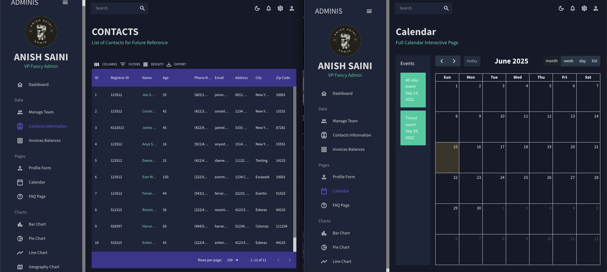

# React Admin Dashboard

A modern, feature-rich admin dashboard built with React, Material-UI, Redux Toolkit, and a variety of charting and data grid libraries. This project is designed to provide a robust foundation for admin interfaces, analytics dashboards, and management panels.

## Features

- **Dashboard Overview**: Key metrics, recent transactions, and interactive charts (line, bar, geography).
- **Team Management**: View and manage team members with roles and access levels.
- **Contacts & Invoices**: Manage contacts and view invoice balances in sortable, filterable data grids.
- **User Form**: Create new user profiles with validation using Formik and Yup.
- **Charts**: Visualize data with Bar, Line, Pie, and Geography charts (Nivo, Chart.js).
- **Calendar**: Full-featured interactive calendar (FullCalendar) with event creation and deletion.
- **FAQ**: Frequently asked questions section with expandable answers.
- **Theming**: Light/dark mode toggle and custom Material-UI theme.
- **Responsive Sidebar**: Collapsible sidebar navigation for all main sections.

## Screenshots

### Dashboard Overview

*Main dashboard with key metrics and charts*

### Team Management

*Team management interface with role-based access control*

### Calendar

*Interactive calendar with event management*

### Data Visualization

*Various chart types for data visualization*

### User Form

*User creation form with validation*

### Responsive Design

*Responsive layout with collapsible sidebar*

## Tech Stack

- **React 18**
- **Material-UI (MUI)**
- **Redux Toolkit**
- **React Router v6**
- **Formik & Yup** (form handling/validation)
- **FullCalendar** (calendar)
- **Nivo & Chart.js** (charts)
- **MUI X Data Grid** (tables)

## Getting Started

### Prerequisites
- Node.js (v14 or higher recommended)
- npm

### Installation

1. Clone the repository:
   ```bash
   git clone <repo-url>
   cd admin-dashboard
   ```
2. Install dependencies:
   ```bash
   npm install
   ```

### Running the App

Start the development server:
```bash
npm start
```
The app will run on [http://localhost:5000](http://localhost:5000) by default.

### Building for Production
```bash
npm run build
```

## Project Structure

- `src/`
  - `components/` — Reusable UI components (Header, charts, etc.)
  - `scenes/` — Main app pages (dashboard, team, invoices, contacts, charts, calendar, FAQ)
  - `data/` — Mock data for tables and charts
  - `theme.js` — Custom Material-UI theme and color tokens
  - `App.js` — Main app component and route definitions

## Customization
- Easily add new pages by creating a new component in `scenes/` and adding a route in `App.js`.
- Modify the theme in `src/theme.js` for branding and color changes.

## License
This project is for educational and demonstration purposes. Please check individual package licenses for production use.

---

Feel free to contribute or use this as a starter for your own admin dashboard!
